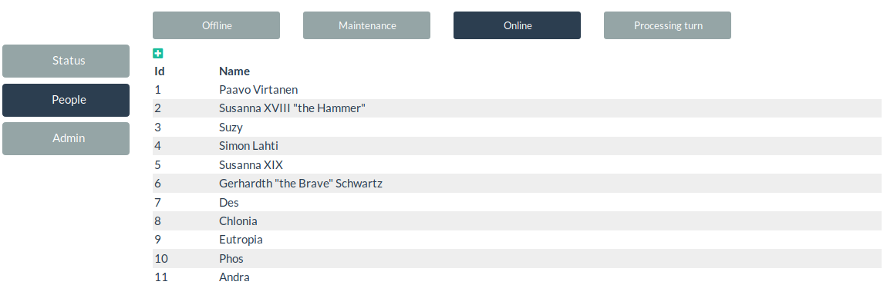
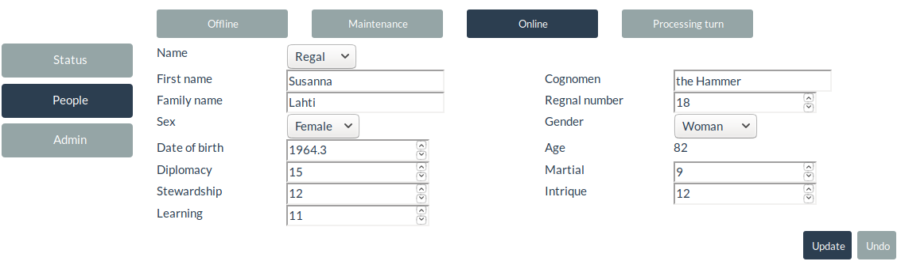
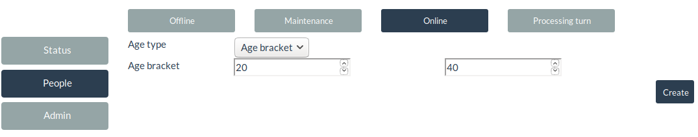

People
======

This view is used to view, edit and create new people for the game. It is
divided to subviews that are used to handle specific tasks.

Viewing existing people
-----------------------

Person listing is the starting point for people management. It shows people
currently present in the simulation. Clicking a row will show edit view
and plus sign at the top shows view where user can generate new person.

Editing
-------

In edit view, user can view and edit values of a person. There are different
types of names a person can have and current type is controlled by name
selection. While simple name consists of just first name and optional
cognomen, regal name has first name, family name, regnal number and optional
cognomen. Regnal number is used to tell apart different nobles who have same
name.

Pressing update will save changes user made and undo will revert them back to
originals.

Creation
--------

Person creation is mainly handled by the system. In creation view, user can
change parameters that affect what kind of person will be created.

Age: By default, computer will pick random age between 1 month and 80 years
for the generated person. User can change this by selected age type from
drop down. Age bracket lets user to specify lower and upper bounds for the
age, while exact age uses age given by user.

Pressign create will initiate generation process and when it has been
completed, user is automatically shown edit view of the new person.

[Back to admin](admin)
