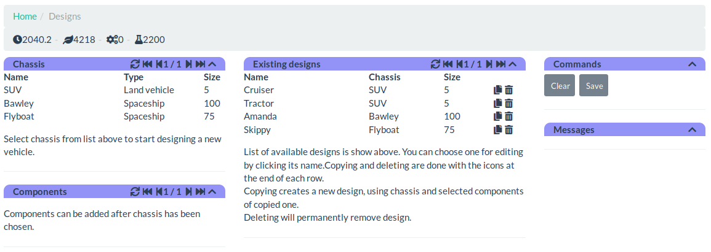
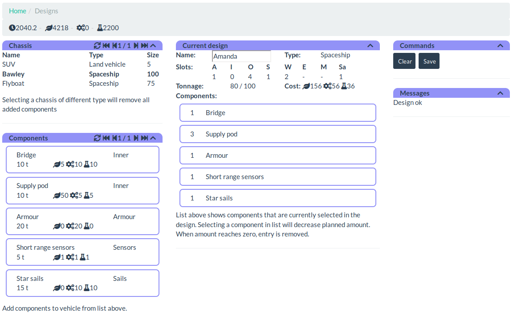

Vehicle designer
================

Before any vehicles can be build, they need to be designed in vehicle
designer.

Existing designs
----------------

When designer is opened, existing designs are shown in the middle panel.
Clicking name of existing design will open that for modifications. On the
right side of each design are two buttons: two pages and a trash can. Button
with two pages is used to create a copy of the design. It retains original
chassis and selected components. Name is erased. Clicking trash can button
will permanently delete the design.

Designing a new vehicle
-----------------------

Designing a new vehicle starts with selection of a chassis from the left panel.
Chassis determines type of the vehicle (for example, land vehicle or space ship)
and size of it. Different chassis are unlocked by performing [research](research).

When chassis has been selected, available designs are replaced with panel that
shows currently selected components, slots, cost and so on. Also, panel on the
bottom left is updated to display components that are available for that
particular chassis.

Components
----------

Vehicles are built from components. Each component have size, cost and slot
where it can be installed. It's not possible to install component to a wrong
kind of slot. Each chassis in turn has maximum weight capacity and amount of
different kinds of slots that limit which components and how many can be
installed.

Chassis can have requirements regarding to components. Bawley for example is
perfectly suitable chassis for just a single star sail, although second one
can be installed. Flyboat on the other hand always requires two star sails.
These requirements are shown on the right side of the screen, inside panel
titled to "Messages".

Completing design
-----------------

When design is ready and there are no unmet requirements, pressing button
labeled "Save" on the right side of the screen will save it. If one would
like to start over without saving, it can be done by selecting a new chassis
or by pressing button labeled "Clear".

[Back to index](index)