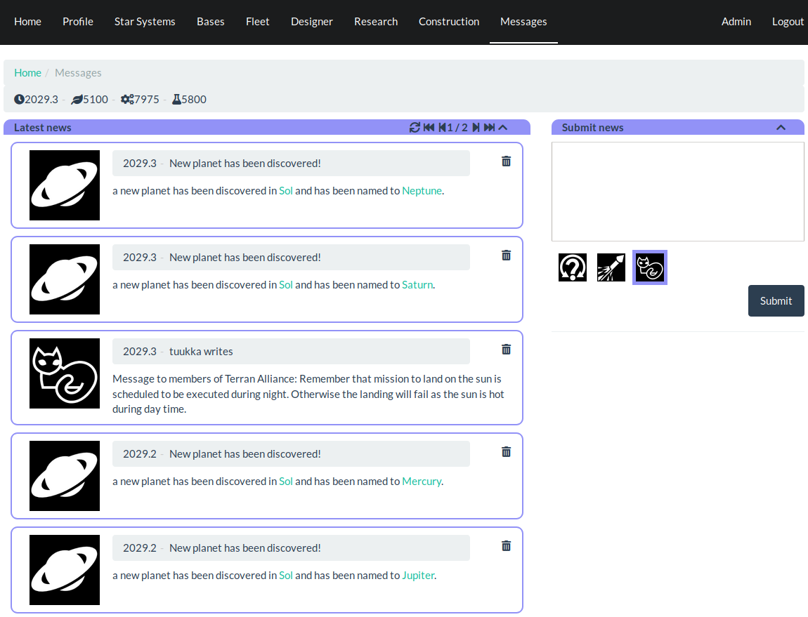

News and Messages
=================

As the game is turn based, messages window allows reviewing of what happened
recently and keeping track of ever expanding imperium.

Latest news
-----------

Left side of the screen is reserved for messages. Controls on the top are used
to move to different pages if there are more messages than fit on single page.
Each message has thrashcan icon that is used to mark it read and remove from
the screen.

Submitting news
---------------

On the right side are controls that are used to submit news. These user
generated news are delivered to every member of the faction. While not useful
long discussion and planning, this allows quickly writing a short message and
delivering it to everyone in the faction.