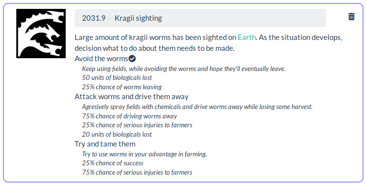

News and Messages
=================

As the game is turn based, messages window allows reviewing of what happened
recently and keeping track of ever expanding imperium.

Latest news
-----------

Left side of the screen is reserved for messages. Controls on the top are used
to move to different pages if there are more messages than fit on single page.
Each message has thrashcan icon that is used to mark it read and remove from
the screen.

Submitting news
---------------

On the right side are controls that are used to submit news. These user
generated news are delivered to every member of the faction. While not useful
long discussion and planning, this allows quickly writing a short message and
delivering it to everyone in the faction.

Special events
--------------

Sometimes there are special events that require decision to be made. Any
memeber of the faction can choose which course of action should be taken by
clicking the corresponding title. Underneath of the title likely results are
explained. Event is then resolved at the end of current turn. Sometimes
one turn is enough to take care of the event, while other times the same event
might linger for multiple turns. In any case, as long as the choices are
visible, player can change their decision.

[Back to index](index)