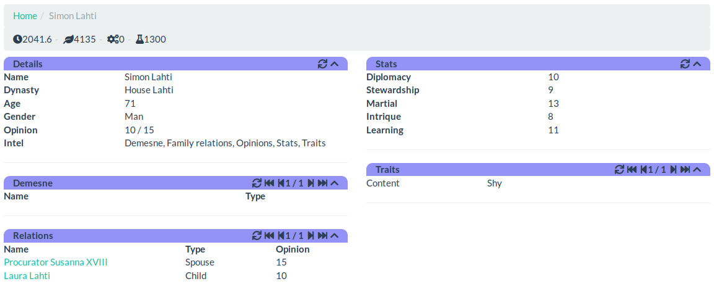

Person
======

Person view displays known information about one person.

Details
-------

Details section shows general information of the character, including name,
age and gender. It also displays list of intel types that are available about
this person. The more intel types are available, the more other information is
available in other sections of the view.

Demesne
-------

If the person is ruler of some sort of region (ie. planet or star system),
regions ruled directly by them are shown here. Without demesne intel type only
primary title and regions directly related to it are shown. With demesne intel
type all ruled regions are listed.

Relations
---------

Relations section shown how this person relates to other people. Family ties,
friendships and rivalries are some of the things shown here. Relations are
divided in three groups: public relations, relations only known by family
and secret relations. Public relations are always known, but other two depend
on intel types family relations and secret relations. Note that having
access to secret relations info is enough to also display family relations.

Stats
-----

Stats section displays how well this person is capable of performing certain
actions. Having access to this information depends on having stats intel.

[Back to index](index)
