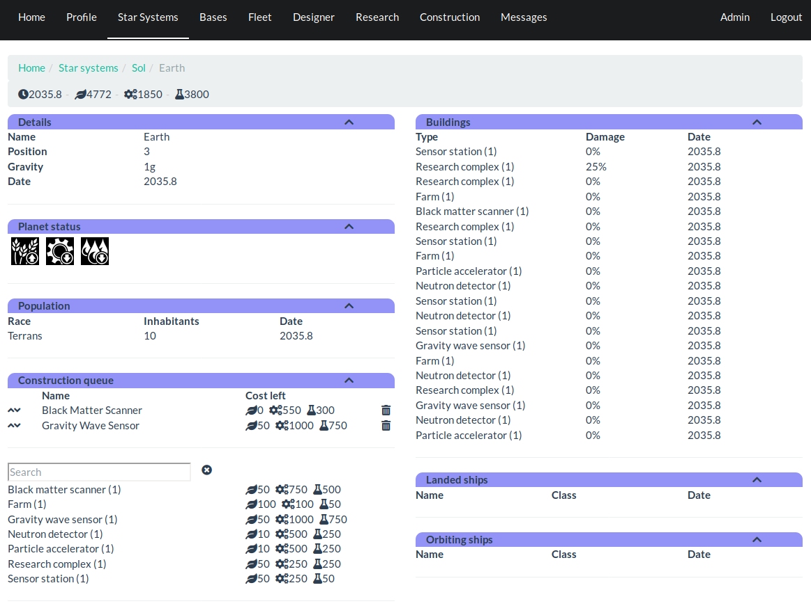

Planet
======

Planet view is used to review known status of a planet and perform operations
like queueing new building projects.

Details
-------

Details section shown general planetary details including location of the
planet in star system and gravity.

Planet status
-------------

Where there is a special condition on the planet, it is shown in planet status
section as a small icon. Brief description of the status can be read on a
pop up that is shown when mouse cursor is on top of a status icon.

Population
----------

Population lists inhabitants of the planet.

Construction queue
------------------

Construction queue shows currently queued building projects and allows player
to add and remove projects. Chevrons on the left side of the queue are used to
reorder building projects, while trashcan on the right side completely removes
the project.

Below the queue is search box, which contents filters which blueprints are
shown below it. Clicking a blueprint will place it in construction queue.

Buildings
---------

Buildings that have been built on the planet are shown in buildings section.
Damage column shown amount of damage building has suffered. Damaged buildings
perform their tasks less efficiently than buildings that have not been damaged.
When damage reaches 100%, building is destroyed and removed.

Landed ships
------------

Ships on surface of the planet are shown here.

Orbiting ships
--------------

Ships orbiting the planet are shown here.

[Back to index](index)