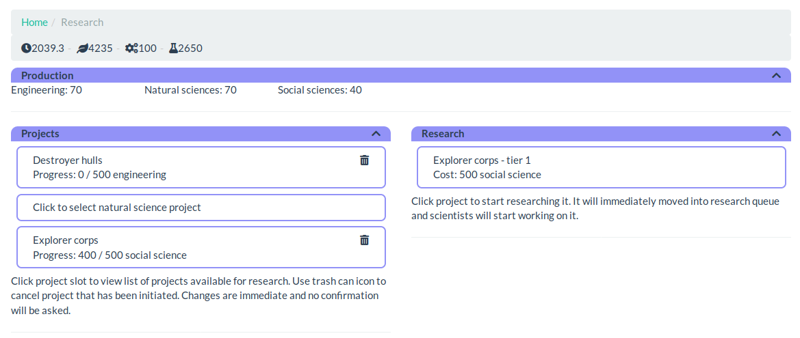

Research
========

Research is integral part of the game and is managed in research screen.

Categories
----------

There are three different categories for research: engineering,
natural sciences and social sciences. Each category has several different
projects that can be reseached.

Projects
--------

On the left side of screen, three slots represent different categories of
research that can be performed. Each category can have only one research
active at any given time. Clicking a slot will show research that is
currently available on the right side of the screen.

Progress of research is shown under project name. It starts from zero and
project completes when it reaches the cost that is shown after slash.

Thrash can on the right edge of a project slot can be used to cancel the
project. This takes effect immediately upon clicking.

Available research
------------------

Research that is available for currently selected slot is show on the right
side. In addition to the name of the research, also cost is shown. Clicking
research will initiate it immediately.

Only small subset of all research is available at any given time. When
progress is made, additional research will unlock.

[Back to index](index)